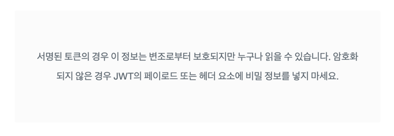

# JWT (Json Web Token)
- JSON 객체에 인증에 필요한 정보들을 담은 후 비밀키로 서명한 토큰
- JSON 객체이기 때문에 Key-Value 쌍으로 들어감
- 압축된 형태의 토큰은 `.`으로 구분된 세 부분으로 구성

`xxxxx.yyyyy.zzzzz`

### Header
- 일반적으로 토큰 유형과 사용되는 서명 알고리즘의 두 부분으로 구성
```json
{
    "alg" : "H512",
    "typ" : "JWT"
}
```
### Payload
- 사용자의 정보가 담겨있는 `Claim` 을 포함

```json
{
  "sub": "1234567890",
  "name": "John Doe",
  "admin": true
}
```
**Header 와 Payload 는 Base64url 로 인코딩 되어 있어 누구나 쉽게 복호화가 가능하다.**\


### Signature
- `base64url`로 암호화된 `header` 와 `payload` 를 합친 후에, 선택한 알고리즘과 암호키를 이용해 암호화 한다.  
```
HMACSHA512 (
  base64UrlEncode(Header) + "." +
  base64UrlEncode(Payload),
  Secret-Key
)
```

```java
private String createToken(String uuid, String tokenType, Long expirationTime) {
    Date now = new Date();

    return AUTHORIZATION_SCHEME_BEARER
            + JWT.create()
            .withSubject(tokenType)
            .withClaim("uuid", uuid)
            .withIssuedAt(now)
            .withExpiresAt(new Date(now.getTime() + expirationTime))
            .sign(Algorithm.HMAC512(SECRET_KEY));
}

...


@Override
public TokenResponseDto issueToken(TokenRequestDto tokenRequestDto) {
    String uuid = UUID.randomUUID().toString();
    String refreshToken = jwtProvider.createRefreshToken(uuid);

    redisTemplate.opsForHash()
            .put(uuid, JwtProvider.REFRESH_TOKEN_SUBJECT, refreshToken);

    String id = tokenRequestDto.getId();

    redisTemplate.opsForHash()
            .put(uuid, "id", id); // UUID 와 MemberId를 매칭 시킴
    redisTemplate.expire(uuid, JwtProvider.REFRESH_EXPIRATION_TIME, TimeUnit.MILLISECONDS);

    String accessToken = jwtProvider.createAccessToken(uuid);

    return new TokenResponseDto(accessToken, refreshToken);
}
```

### Bearer 를 굳이 붙이는 이유
- https://velog.io/@cada/%ED%86%A0%EA%B7%BC-%EA%B8%B0%EB%B0%98-%EC%9D%B8%EC%A6%9D%EC%97%90%EC%84%9C-bearer%EB%8A%94-%EB%AC%B4%EC%97%87%EC%9D%BC%EA%B9%8C

### LocalStorage or Cookie
- LocalStorage
  - 추가적인 설정이 필요하지 않고 빠르고 읽고 쓸 수 있어 성능이 우수
  - XSS (Cross-Site Scripting) : JS로 LocalStorage 에 침투하여 탈취할 수 있다.
  - CSRF (Cross-Site Request Forgery) 공격 취약
- Cookie
  - HttpOnly 와 Secure 옵션을 설정하여 XSS 공격 예방 가능
  - SameSite 옵션으로 CSRF 공격도 예방 가능
  - 크기가 제한되어 있기 때문에 크기가 큰 토큰은 저장 불가
  - 모든 HTTP 요청에 쿠키가 포함되기 때문에 성능에 영향을 줄 수 있다.

### 장점
- 클라이언트 측 저장 가능 (`LocalStorage` or `Cookie`)
  - 검증된 JWT 에는 인증에 필요한 정보들이 자체적으로 내재되어 있기 때문에 서버가 상태를 유지할 필요가 없음 (Stateless)
  - 인증을 위해 DB 와 연동할 필요가 없다.
  - 따라서 서버의 확장성이 늘어난다.
- Session 을 사용할 수 없는 모바일 같은 환경에서 사용하기 적합하다.
### 단점
- `Payload`에 들어가는 정보에 따라 JWT 크기가 커질 수 있다.
- 한번 생성하면 변경이 불가능하다. (유효기간 설정)
- 보안에 취약하다
- 따라서 탈취당했을 때 대처가 어렵다.

--- 

### JWT 의 주된 목적은 `보안`이 아닌 `자격증명` (정보 보호가 아닌 위조 방지)

---

### Access Token & Refresh Token
- Access Token : 실제 Client-Server 간의 통신을 할 때 사용
- Refresh Token : Access Token 을 재발급 하기 위해 사용

### Refresh Token 을 사용하는 이유
- 통신이 빈번한 Access Token 은 탈취 가능성이 높다.
- 만료 기간을 짧게두어 주기적으로 재발급을 한다면 (DB 와 통신해야 한다) 재로그인이 너무 잦아져 사용성이 떨어짐
- 통신이 적은 Refresh Token 으로 Access Token 으로 재발급을 하여 로그인을 유지할 수 있다. 

### Refresh Token 통신 과정
1. 로그인에 성공하면 두 개의 토큰을 받아 클라이언트가 별도로 저장 (LocalStorage or Cookie)
2. Access Token 이 만료되었을 때, 가지고 있는 Refresh 토큰으로 Access Token 재발급
3. Refresh Token 도 만료되었다면, 재로그인 유도

```java
try {
  Cookie accessTokenCookie = CookieUtil.findCookie(request, "accessToken");
  String accessToken = accessTokenCookie.getValue();
  
  // TODO: AccessToken 유효성 검사
  
  // Access 토큰이 만료되었는지 확인
  if (!isExpired(accessToken)) {
      filterChain.doFilter(request, response);
  
      return;
  }
  
  // 만료되었다면 Refresh Token 도 만료되었는지 확인
  Cookie refreshTokenCookie = CookieUtil.findCookie(request, "refreshToken");
  String refreshToken = refreshTokenCookie.getValue();
  
  // Refresh Token 도 만료되었다면, 재로그인 요청
  if (isExpired(refreshToken)) {
      throw new TokenExpiredException();
  }
  
  // Refresh Token 이 살아있다면, Refresh Token 을 Auth Server 로 보내서 AccessToken 재발급 (Refresh Token Rotation)
  TokenAuthRequestDto tokenAuthRequestDto = new TokenAuthRequestDto(refreshToken);
  TokenResponseDto tokenResponseDto = tokenService.reissueToken(tokenAuthRequestDto);
  
  // 재발급을 완료헀다면 토큰들을 쿠키에 갱신
  updateJwtTokenCookie(request, response, tokenResponseDto);
  log.debug("JwtFilter : Finish reissue Token");
  
  // Auth 서버에서 토큰이 인증이 되었다면, 인증된 정보를 SecurityContextHolder 에 넣어서 사용
  String uuid = getUuid(accessToken);
  String memberId = getMemberId(uuid);
  
  UserDetails memberDetails = memberDetailsService.loadUserById(memberId);
  
  UsernamePasswordAuthenticationToken token =
          new UsernamePasswordAuthenticationToken(
                  memberDetails.getUsername(),
                  null,
                  memberDetails.getAuthorities());
  
  SecurityContextHolder.getContext().setAuthentication(token);
  
  filterChain.doFilter(request, response);
            ...
```

---

### Refresh Token 이 탈취 당하면?

---

### Refresh Token Rotation
- Access Token 재발급 될 때 (Refresh Token 이 사용될 때), Refresh Token 도 같이 재발급하여 제공한다. (One Time Use Only)
- Refresh Token 의 기간동안 무한정으로 Access Token 이 재발급 되는걸 방지

### Refresh Token 을 Redis 에 저장하는 이유
- Redis 는 In-Memory (RAM) 에 저장하여 사용하기 때문에, 가급적 빈도수가 높은 Refresh Token 을 조회하는데 빠르게 조회할 수 있다.
- 데이터에 TTL (Time-To-Live) 를 줄 수 있다. (JWT Token 의 만료시간과 맞춰 삭제할 수 있다.)
- 분산 환경에서 사용할 수 있고 확장성이 높다.
```java
redisTemplate.opsForHash()
            .put(uuid, JwtProvider.REFRESH_TOKEN_SUBJECT, refreshToken);

String id = tokenRequestDto.getId();

    redisTemplate.opsForHash()
            .put(uuid, "id", id); // UUID 와 MemberId를 매칭 시킴
    redisTemplate.expire(uuid, JwtProvider.REFRESH_EXPIRATION_TIME, TimeUnit.MILLISECONDS);
```

## References

---
- https://jwt.io/
- https://velog.io/@chuu1019/%EC%95%8C%EA%B3%A0-%EC%93%B0%EC%9E%90-JWTJson-Web-Token
- https://cheatsheetseries.owasp.org/cheatsheets/HTML5_Security_Cheat_Sheet.html#local-storage
- https://inpa.tistory.com/entry/WEB-%F0%9F%93%9A-JWTjson-web-token-%EB%9E%80-%F0%9F%92%AF-%EC%A0%95%EB%A6%AC#token_%EC%9D%B8%EC%A6%9D_%EB%B0%A9%EC%8B%9D