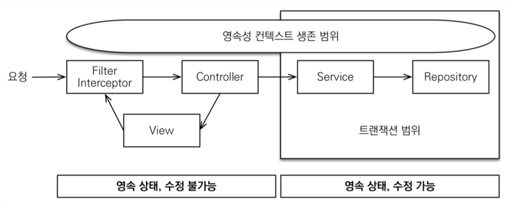

# • OSIV(OPEN SESSION IN VIEW)

**OSIV(Open Session In View)**

OSIV는 "Open Session In View"의 약자로, JPA(Java Persistence API) 환경에서 사용되는 패턴입니다. 이 패턴의 핵심은 사용자의 요청이 시작되는 시점부터 종료될 때까지 데이터베이스 세션을 열어두는 것입니다. 즉, 한 요청의 수명 주기 동안 데이터베이스와의 연결을 계속 유지합니다.

**목적**: OSIV는 지연 로딩(Lazy Loading) 문제를 해결하기 위해 사용됩니다. 지연 로딩은 데이터를 필요할 때까지 로드하지 않는 방식으로, 이는 메모리 사용을 최적화하지만, 세션 밖에서 필요한 데이터에 접근하려 할 때 LazyInitializationException을 발생시킬 수 있습니다. OSIV를 사용하면 요청의 전체 수명 주기 동안 세션이 열려 있기 때문에, 이러한 예외를 방지할 수 있습니다.

• 스프링 부트 어플리케이션은 기본적으로 OSIV가 활성화 되어 있다. 하지만 스프링 부트 2.0부터 명시적으로 설정하지 않을 시 경고가 표시된다

```
spring.jpa.open-in-view is enabled by default. Therefore, database
queries may be performed during view rendering.Explicitly configure
spring.jpa.open-in-view to disable this warning
```

- **장점**:
    - **지연 로딩 문제 해결**: 프리젠테이션(controller) 계층에서 지연 로딩을 사용할 때 발생하는 문제를 해결합니다.
    - **성능 최적화**: 데이터베이스 연결을 재사용함으로써 성능을 개선할 수 있습니다.
- **단점**:
    - **리소스 사용 증가**: 요청이 오래 지속될 경우, 데이터베이스 연결이 계속 유지되어 리소스 사용량이 증가합니다.
    - **트랜잭션 관리 복잡성 증가**: 세션을 오랫동안 열어두면 트랜잭션 관리가 복잡해질 수 있습니다.

## OSIV ON



DB 트랜잭션을 시작할 때 JPA 영속성 컨텍스트가 DB 커넥션을 가져온다.

OSIV가 켜져있으면 @Transactional 메서드를 벗어나도 커넥션을 계속 유지한다.API 응답이 나가고 화면이 렌더링 될 때까지 영속성 컨텍스트를 물고 있는다.

그래서 View Template이나 Controller 단에서도 지연 로딩으로 데이터를 가져올 수 있었던 것이다.지연 로딩은 영속성 컨텍스트가 살아 있어야 가능하다.

너무 오랫동안 DB 커넥션을 사용하기 때문에 실시간 트래픽이 중요한 애플리케이션에서는 커넥션이 모자랄 수 있다.결국 장애로 이어진다.

로직 상에서 외부 API를 호출한다면 이걸 처리하는 시간만큼 커넥션 리소스를 반환하지 못한다.

지연 로딩을 적극 활용할 수 있다는 장점이 있다.

## OSIV OFF


트랜잭션을 종료할 때 영속성 컨텍스트를 닫고 DB 커넥션을 반환한다.

따라서 커넥션 리소스를 낭비하지 않는다.

트랜잭션으로 가져온 데이터를 요청한 지점에서 반환한 다음엔 DB 커넥션을 쓰지 않는다.사용자 요청이 많을 경우 유연하게 사용할 수 있다.

모든 지연 로딩을 트랜잭션 안에서 해결해야 한다.지연 로딩을 하려면 영속성 컨텍스트가 살아있어야 한다.지금까지 구현한 많은 지연 로딩 코드를 트랜잭션 안으로 넣어줘야 한다.따라서 트랜잭션이 끝나기 전에 지연 로딩을 강제로 호출해두거나 fetch join을 사용해야 한다.

## 예제 코드

**엔티티 클래스 정의**

```java
@Entity
public class User {
    @Id
    @GeneratedValue(strategy = GenerationType.IDENTITY)
    private Long id;

    private String name;

    @OneToOne(fetch = FetchType.LAZY)
    private Profile profile;

}

@Entity
public class Profile {
    @Id
    @GeneratedValue(strategy = GenerationType.IDENTITY)
    private Long id;

    private String details;

}
```

**서비스 레이어**

```java
@Service
@Transactional
public class UserService {
    @Autowired
    private UserRepository userRepository;

    public User getUserById(Long id) {
        return userRepository.findById(id).orElse(null);
    }
}
```

**컨트롤러 레이어**

```java
@RestController
public class UserController {
    @Autowired
    private UserService userService;

    @GetMapping("/user/{id}")
    public String getUserProfileDetails(@PathVariable Long id) {
        User user = userService.getUserById(id);
        // 트랜잭션이 이미 종료된 상태
        return user.getProfile().getDetails(); // 여기서 LazyInitializationException 발생
    }
}
```

LazyInitializationException 발생

```java
org.hibernate.LazyInitializationException: could not initialize proxy - no Session
```

## **OSIV를 사용할까 말까?**

- .
    - 간단한 서비스라면 OSIV의 생산성 증대가 도움이 될 수도 있다
    - 하지만 조금이라도 서비스가 복잡해지면 OSIV로 인한 문제들이 발생할 수 있다. 특히 외부 호출이 잦거나 트랜잭션 밖에서 로직이 많은 경우 OSIV를 **비활성화하는 것이 매우 추천**된다