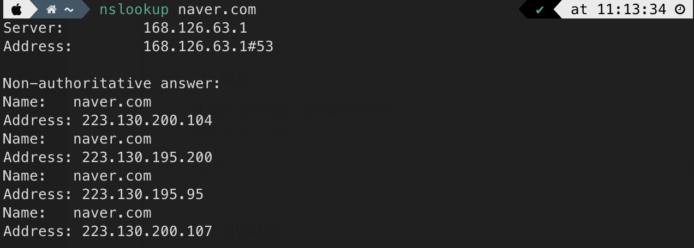

# Spring cloud gateway

## 1 - API Gateway

Client — API Gateway — Backend Service


→ 클라이언트와 백엔드 서비스 사이에 위치하는 리버스 프록시 역할을 하는 서비스

### 1.1 - proxy

클라이언트가 자신을 통해서 다른 네트워크 서비스에 간접적으로 접속할 수 있게 해주는 시스템, 응용 프로그램

- 보안성, 성능, 안정성 향상
- forward proxy, reverse proxy


### Forward Proxy

우리가 흔히 말하는 **프록시 서버**

- 클라이언트가 인터넷 요청을 보내면, 프록시 서버가 가로채고 다시 프록시 서버가 해당 요청을 웹서버에 보냄
- 프록시 서버는 웹 서버로부터 받은 응답을 다시 클라이언트에게 전달
- 학교에서 게임 사이트나 불법 사이트 접근 못하게 막는 것
    - 기관에 속한 유저가 특정 컨텐츠에 접근하는 것을 방지
- 익명성을 보장

### Reverse Proxy


웹서버 앞에 프록시 서버가 놓여 있음

- 로드 밸런싱(Load balancing)

  

    - 대량의 트래픽을 하나의 싱글 서버로 감당하기 어려우므로, 특정 서버가 과부화 되지 않게 로드 밸런싱
    - 보안
        - 서버의 본래 IP주소를 노출시킬 필요 없음
    - 캐싱, SSL 암호화

### MSA(Micro Service Architecture)

- 소프트웨어 시스템을 여러 작은 독립적인 서비스로 분할, 개발, 배포

### 1.2 - 목적

> 하나의 시스템을 마이크로서비스화(coupon, api, auth …)함에 따라 발생하는 트래픽, API 숫자 증가 → 전체적인 API 관리 포인트의 필요성
>

## 2 - Spring Cloud Gateway

### 2.1 - 동작


1. 클라이언트가 Spring Cloud Gateway로 요청
2. Gateway Handler Mapping이 Route의 조건에 일치하는 요청이라고 판단
    1. Gateway Web Handler가 요청에 관련된 필터들을 통해 요청을 보냄
    2. Filter는 요청의 기능에 따른 로직을 수행

### 2.2 - 결론


우리가 `ckin-gateway` 의 IP address, Port number만 알고 있으면


`front` 에서 각 api(`coupon`, `api`, `auth`)로 요청을 보낼 때, `endpoint`만 바꿔서 보내면 된다

### 2.3 - 구성요소


### Route

고유 ID, 목적지 URI, Predicate, Filter로 구성된 구성 요소

- Gateway로 요청된 URI 조건이 참인 경우 매핑된 해당 URI로 매칭

```java
r -> r.path("/auth/**")
// "/auth" 하위로 들어오는 모든 요청의 경우

.uri("http://133.186.222.126:7010")
// 매핑된 해당 URI로 매칭
```

### Predicate

주어진 요청이 주어진 조건을 충족하는 지 테스트하는 구성 요소

만약 매칭되는 Predicate가 하나도 없다면 `404 Not Found` 를 응답

### Filter

들어오는 요청, 나가는 응답에 대하여 필요한 로직 작성

### 2.4 - 코드

```java
@Configuration
@RequiredArgsConstructor
public class RouteConfig {
    private final ServerInfoProperties serverInfoProperties;
    @Bean
    public RouteLocator customRouteLocator(RouteLocatorBuilder routeLocatorBuilder) {
        return routeLocatorBuilder.routes()
                .route("ckin-auth", r -> r.path("/auth/**")
                        .uri(serverInfoProperties.getAuthUri()))
                .route("ckin-coupon", r -> r.path("/coupon/**")
                        .uri(serverInfoProperties.getCouponUri()))
                .route("ckin-api", r -> r.path("/api/**")
                        .uri(serverInfoProperties.getApiUri()))
                .build();
    }
}
```

### application.properties의 경우

```java
spring.cloud.gateway.routes[0].id=pgService
spring.cloud.gateway.routes[0].uri=http://localhost:2005/
spring.cloud.gateway.routes[0].predicates[0]=Path=/employee/**
spring.cloud.gateway.routes[1].id=inMateService
spring.cloud.gateway.routes[1].uri=http://localhost:2006/
spring.cloud.gateway.routes[1].predicates[0]=Path=/consumer/**
```

### 2.5 - 확장


## 3 - 동작

API 서버로의 직접 요청

```java
GET http://localhost:7030/api/tag
Content-Type: application/json
```

→ 응답

```java
HTTP/1.1 200 
Content-Type: application/json
Transfer-Encoding: chunked
Date: Fri, 16 Feb 2024 05:31:51 GMT
Keep-Alive: timeout=60
Connection: keep-alive

[
  {
    "tagId": 1,
    "tagName": "hello"
  },
  {
    "tagId": 2,
    "tagName": "hello"
  },
  {
    "tagId": 3,
    "tagName": "hello"
  },
  {
    "tagId": 4,
    "tagName": "hello"
  },
  {
    "tagId": 5,
    "tagName": "hello"
  }
]
```

Gateway 서버로의 요청

```java
GET http://localhost:9010/api/tag
Content-Type: application/json
```

→ 응답

```java
HTTP/1.1 200 
Content-Type: application/json
Transfer-Encoding: chunked
Date: Fri, 16 Feb 2024 05:31:51 GMT
Keep-Alive: timeout=60
Connection: keep-alive

[
  {
    "tagId": 1,
    "tagName": "hello"
  },
  {
    "tagId": 2,
    "tagName": "hello"
  },
  {
    "tagId": 3,
    "tagName": "hello"
  },
  {
    "tagId": 4,
    "tagName": "hello"
  },
  {
    "tagId": 5,
    "tagName": "hello"
  }
]
```


## Reference

---

[https://metanetglobal.com/bbs/board.php?bo_table=tech&wr_id=38](https://metanetglobal.com/bbs/board.php?bo_table=tech&wr_id=38)

[https://losskatsu.github.io/it-infra/reverse-proxy/#3-리버스-프록시reverse-proxy-서버란](https://losskatsu.github.io/it-infra/reverse-proxy/#3-%EB%A6%AC%EB%B2%84%EC%8A%A4-%ED%94%84%EB%A1%9D%EC%8B%9Creverse-proxy-%EC%84%9C%EB%B2%84%EB%9E%80)