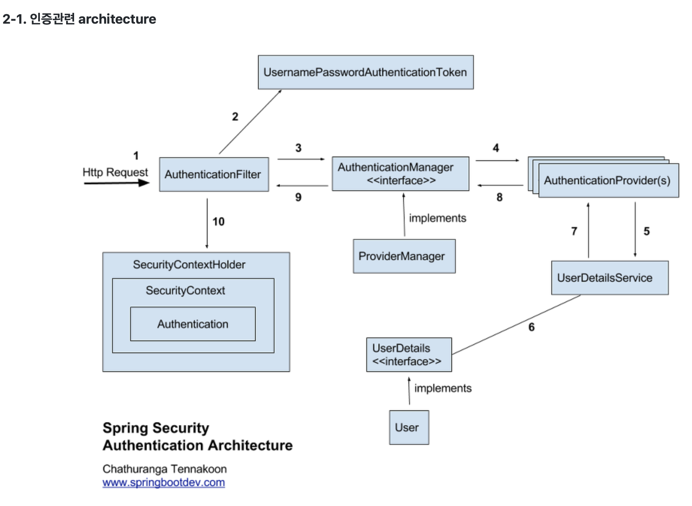
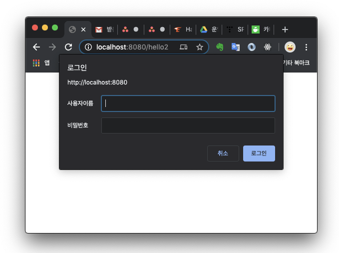
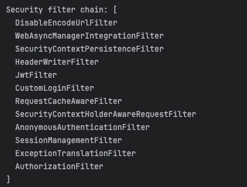
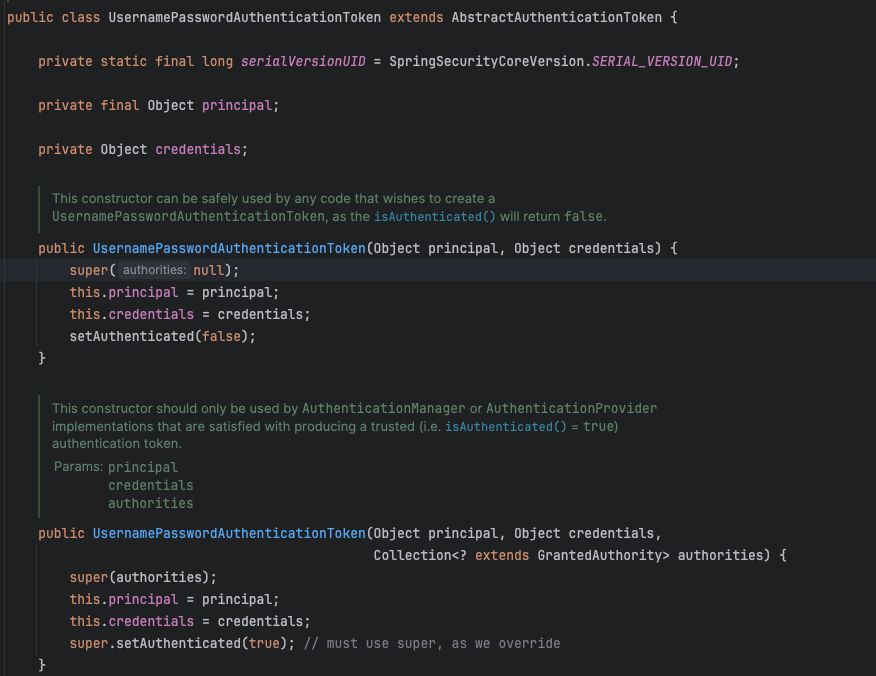

# Spring Security
Spring 기반 애플리케이션을 위해 선언적 보안 기능을 제공하는 보안 프레임워크 \
Servlet Filter (Servlet 기반 애플리케이션) 및 AOP 기반

개발자 : Security가 제공하는 Filter와 설정을 커스텀 하여 원하는 인증 절차를 개발

### 인증 (Authentication)
자신이 누구라고 주장하는 주체를 확인하는 프로세스

### 인가 (Authorization)
인증된 사용자가 어떤 자원에 접근할 수 있는지 확인하는 절차



### 1. AuthenticationFilter
```java
@Configuration
@EnableWebSecurity
@RequiredArgsConstructor
public class SecurityConfig {
    // 5.7.0-M2 버전 이후로 WebSecurityConfigurerAdapter 는 deprecated 됨
    // filterChain 을 Bean 으로 등록하여 설정해줘야 함.
    @Bean
    public SecurityFilterChain filterChain(HttpSecurity http) throws Exception {
        http
                .csrf().disable()
                .sessionManagement()
                .sessionCreationPolicy(SessionCreationPolicy.STATELESS)
                .and()
                .httpBasic().disable()
                .formLogin().disable()
                .logout().disable()
                .authorizeHttpRequests(auth -> auth
                        .requestMatchers("/", "/home", "/login", "/signup").permitAll()
                        .requestMatchers("/admin/**").hasRole("ADMIN")
                        .requestMatchers("/member/**").hasRole("MEMBER")
                        .anyRequest().authenticated())
                .addFilterBefore(jwtFilter(), CustomLoginFilter.class)
                .addFilterBefore(customLoginFilter(), UsernamePasswordAuthenticationFilter.class);

        return http.build();
    }
}
```

- Cross Site Request Forgery (사이트간 위조 요청)\
사용자가 자신의 의지와는 무관하게 공격자가 의도한 행위(수정, 삭제, 등록 등)를 특정 웹사이트에 요청하게 하는 공격\
해당공격은 세션과 쿠키를 통한 인증을 하고 있을 때 발생할 수 있음\
JWT 같이 세션을 사용하지 않는 인증 방식에서는 CSRF에 대해 어느정도 안전하기 때문에 ``disable()``
- ``.sessionCreationPolicy(SessionCreationPolicy.STATLESS)`` : 세션을 사용하지 않겠다는 설정\
인증정보를 서버에 담아두지 않는다.


- ``httpBasic`` : Http Basic Auth 기반의 로그인 인증
\
\


- ``formLogin`` ``logout`` : Security 에서 기본적으로 제공하는 기능



### UsernamePasswordAuthenticationFilter
filterChain 에서 가장 먼저 접근하게 되는 Filter\
로그인에 관한 Post 요청을 낚아채서 대신 처리해줌
```java
@PostMapping("/login")
public String postLogin() {
    ...
    return "redirect:/";
}
```
```java
public class UsernamePasswordAuthenticationFilter extends AbstractAuthenticationProcessingFilter {

    public static final String SPRING_SECURITY_FORM_USERNAME_KEY = "username";

    public static final String SPRING_SECURITY_FORM_PASSWORD_KEY = "password";

    private static final AntPathRequestMatcher DEFAULT_ANT_PATH_REQUEST_MATCHER = new AntPathRequestMatcher("/login",
            "POST");

    private String usernameParameter = SPRING_SECURITY_FORM_USERNAME_KEY;

    private String passwordParameter = SPRING_SECURITY_FORM_PASSWORD_KEY;

    private boolean postOnly = true;
```

```java
@Bean
public CustomLoginFilter customLoginFilter() throws Exception {
    CustomLoginFilter filter =  new CustomLoginFilter(tokenService, cookieUtil);
    filter.setAuthenticationManager(authenticationManager(null));
    filter.setUsernameParameter("email");
    filter.setPasswordParameter("password");

    return filter;
}

@Slf4j
@RequiredArgsConstructor
public class CustomLoginFilter extends UsernamePasswordAuthenticationFilter {
    private final TokenService tokenService;

    private final CookieUtil cookieUtil;

    @Override
    public Authentication attemptAuthentication(HttpServletRequest request, HttpServletResponse response) throws AuthenticationException {
        log.debug("CustomLoginFilter : Try Login Authentication");

        UsernamePasswordAuthenticationToken token =
                new UsernamePasswordAuthenticationToken(obtainUsername(request), obtainPassword(request));

        return getAuthenticationManager().authenticate(token);
    }

    @Override
    protected void successfulAuthentication(HttpServletRequest request, HttpServletResponse response, FilterChain chain, Authentication authResult) throws IOException, ServletException {
        UsernamePasswordAuthenticationToken authenticationToken = (UsernamePasswordAuthenticationToken) authResult;

        String id = authenticationToken.getName();

        TokenRequestDto tokenRequestDto = new TokenRequestDto(id);

        TokenResponseDto tokenResponseDto = tokenService.getToken(tokenRequestDto);
        addTokenCookie(response, tokenResponseDto);

        response.sendRedirect("/");
    }
    ...
}
```
### 2. UsernamePasswordAuthenticationToken
``Authentication을`` ``implements``한 ``AbstractAuthenticationToken``의 하위 클래스



### 2. AuthenticationProvider
실제 인증을 처리하는 클래스
```java
@Slf4j
@RequiredArgsConstructor
public class CustomAuthenticationProvider implements AuthenticationProvider {
    private final MemberDetailsService memberDetailsService;

    private final BCryptPasswordEncoder bcryptPasswordEncoder;

    @Override
    public Authentication authenticate(Authentication authentication) throws AuthenticationException {
        log.debug("CustomAuthenticationProvider : Try Authentication");
        // 인증 전의 Authentication 객체
        UsernamePasswordAuthenticationToken token = (UsernamePasswordAuthenticationToken) authentication;

        String email = token.getName();
        String password = (String) token.getCredentials();

        UserDetails userDetails = memberDetailsService.loadUserByUsername(email);

        if (!bcryptPasswordEncoder.matches(password, userDetails.getPassword())) {
           throw new BadCredentialsException(email + " : Invalid password");
        }

        return new UsernamePasswordAuthenticationToken(userDetails.getUsername(), null, userDetails.getAuthorities());
    }

    @Override
    public boolean supports(Class<?> authentication) {
        return authentication.equals(UsernamePasswordAuthenticationToken.class);
    }
}


@Bean
public CustomAuthenticationProvider customAuthenticationProvider() {
    return new CustomAuthenticationProvider(memberDetailsService, bcryptPasswordEncoder());
}
```

### 3. AuthenticationManager
등록된 ``AuthenticationProvider``를 ``List``로 갖고 있으며, ``for`` 문을 통해 ``authenticate`` 처리를 한다.
```java
@Override
public Authentication authenticate(Authentication authentication) throws AuthenticationException {
    Class<? extends Authentication> toTest = authentication.getClass();
    AuthenticationException lastException = null;
    AuthenticationException parentException = null;
    Authentication result = null;
    Authentication parentResult = null;
    int currentPosition = 0;
    int size = this.providers.size();
    for (AuthenticationProvider provider : getProviders()) {
        if (!provider.supports(toTest)) {
            continue;
        }
        ...
    }
```

### 4. UserDetailsService
사용자의 정보를 DB를 통해 조회하여 UserDetails 를 리턴
```java
public class MemberDetailsService implements UserDetailsService {
    private final MemberAdapter memberAdapter;

    @Override
    public UserDetails loadUserByUsername(String email) {
        Optional<MemberAuthResponseDto> memberAuthResponseDto =
                memberAdapter.getMemberAuthInfo(new MemberAuthRequestDto(email));

        MemberAuthResponseDto memberInfo;

        if (memberAuthResponseDto.isPresent()) {
            memberInfo = memberAuthResponseDto.get();
            Collection<GrantedAuthority> authorities = new ArrayList<>();
            authorities.add(memberInfo::getRole);

            return new User(memberInfo.getId().toString(), memberInfo.getPassword(), authorities);
        }

        throw new UsernameNotFoundException(email + " : email 에 대한 정보가 없어 인증에 실패 하였습니다.");
    }
}
```

### 5. UserDetails
유저의 정보를 담는 인터페이스
```java
public interface UserDetails extends Serializable {

    Collection<? extends GrantedAuthority> getAuthorities();

    String getPassword();

    String getUsername();

    boolean isAccountNonExpired();

    boolean isAccountNonLocked();

    boolean isCredentialsNonExpired();

    boolean isEnabled();

}
```

### 6. SecurityContextHolder


